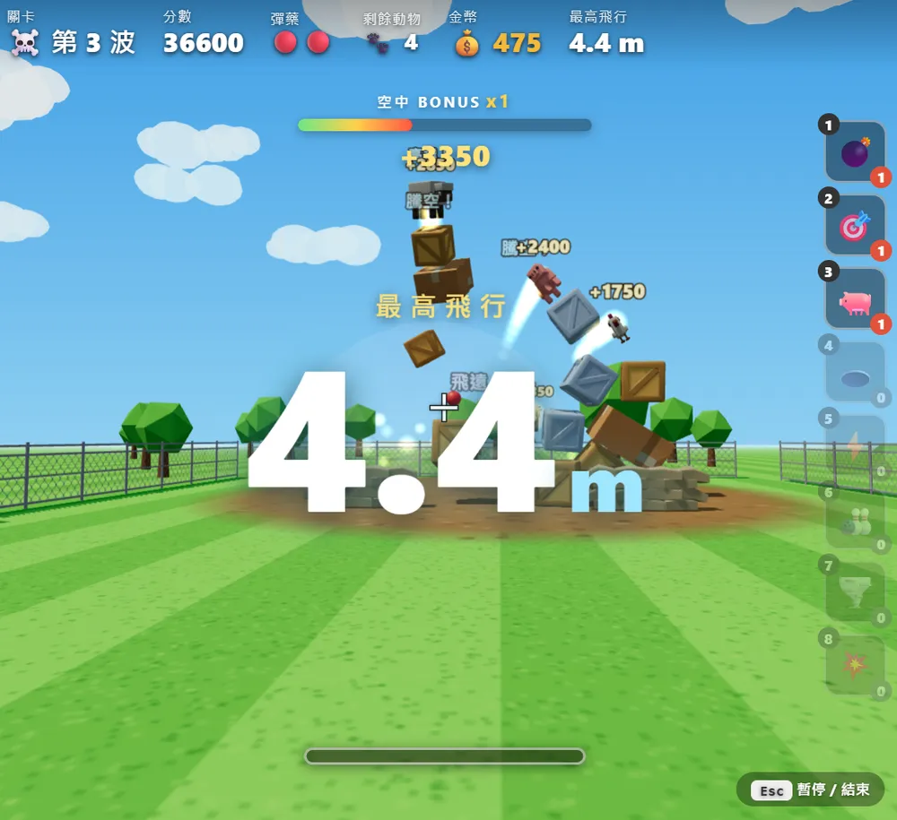
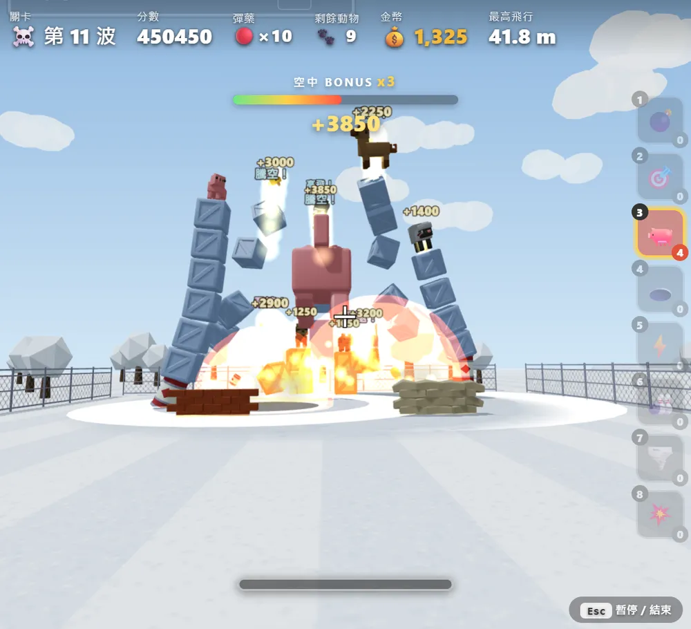
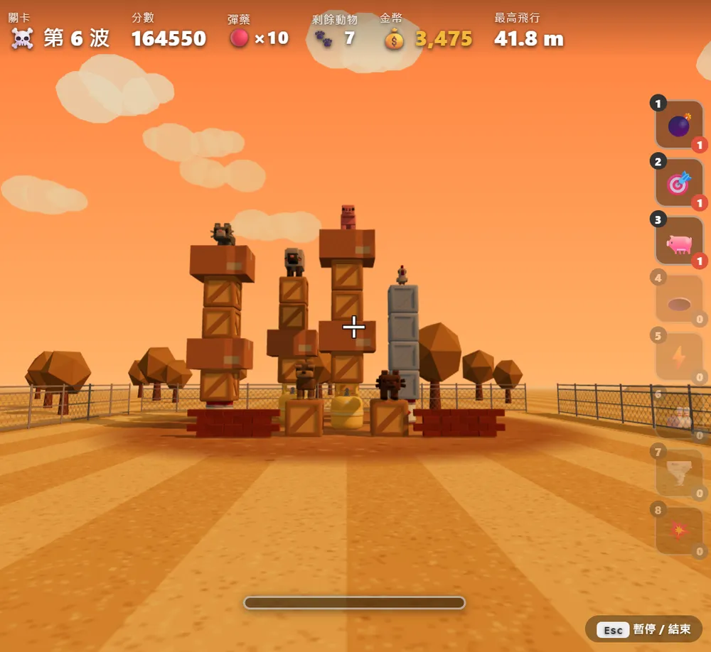
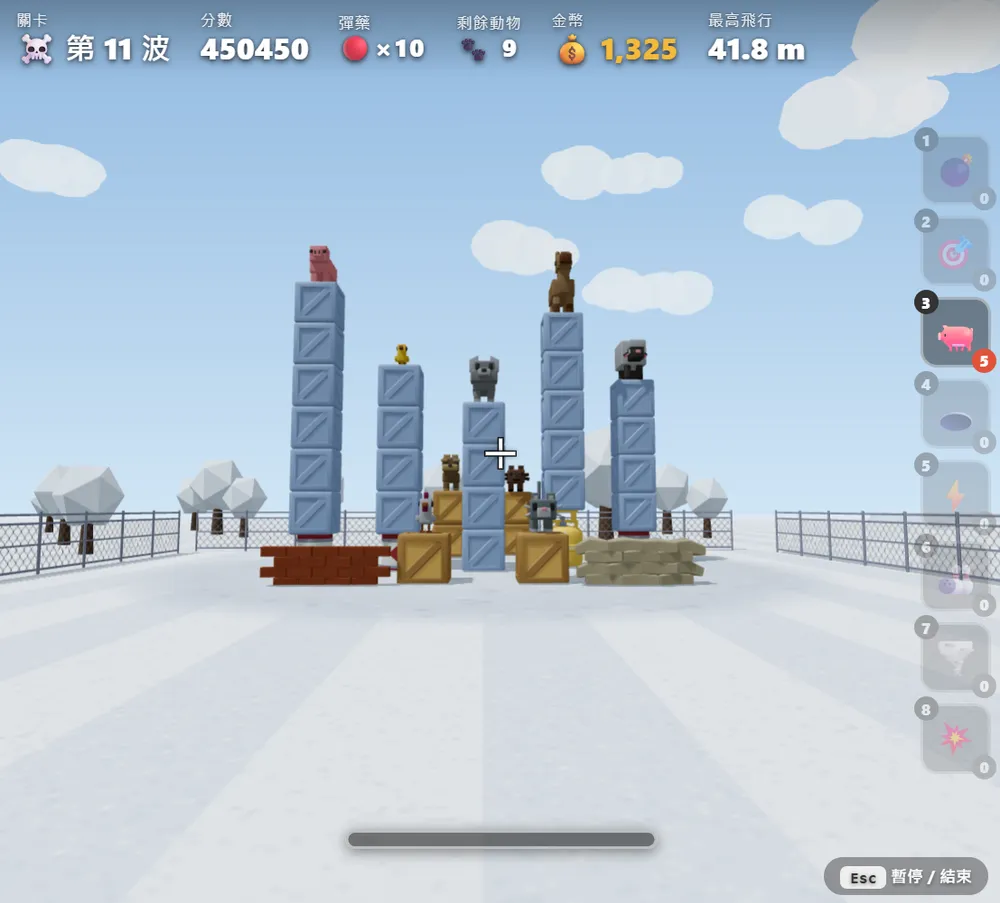
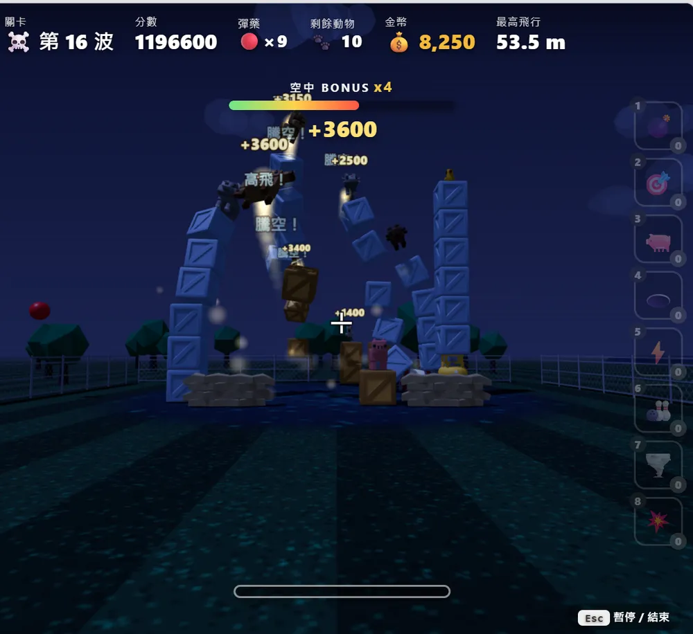

# 🐷 Angry Pig — 第一人稱 3D 投擲破壞遊戲

用 **three.js** 渲染、**cannon-es** 3D 物理打造的憤怒鳥風格遊戲。第一人稱瞄準、蓄力丟球，砸垮用木箱／磚牆／貨櫃／沙包搭建的堡壘，把站在上面的動物撞下來摔到地板即消滅。含全球排行榜、特殊彈藥、金幣商店、Boss 動物與多套場景。

- 🎮 **線上遊玩（含全球排行榜）：** https://angry-pig.pages.dev


## 遊戲模式

| 模式 | 說明 |
|------|------|
| 🏰 **故事關卡** | 15 關遞增難度，依剩餘彈藥給 1~3 星，逐關解鎖 |
| ☠️ **死鬥模式** | 無盡波數，金幣經濟 + 每 10 波補給商店，每 5 波出 Boss |
| 😄 **快樂模式** | 同死鬥但所有特殊彈無限、怪物成群，純爽度 |
| 🚀 **飛最高** | 記錄把動物打飛的最高高度，獨立排行榜 |

## 玩法

- **移動滑鼠**：環顧瞄準（畫面中央準星）
- **按住左鍵**：蓄力（越久越大力，底部有蓄力條 + 拋物線預測）
- **放開左鍵**：朝準星方向丟球
- **數字鍵 1~8**：切換特殊彈藥（死鬥／快樂）
- **M**：開關背景音樂　**Esc**：暫停 / 返回選單
- **手機**：左下虛擬搖桿控視角、右下發射鈕蓄力放開
- 把動物 🐷🐑🐔🐱🐕🦝🐺🐴🐤 撞下箱子摔到地板就消滅；打中爆炸桶 🛢️ / 瓦斯桶 ⛽ 會連環爆
- 短時間內連續擊殺會累計 **Combo 連擊**（跳字 + 音階上升 + 額外得分）；每次擊殺有 **Hit-stop 頓幀**強化打擊感
- **🎯 空中狙擊**：先把動物打飛，趁牠在空中用第二發紅球命中 → 賞金 **+1000**（死鬥再送 1000 金幣）
- **⚙️ 設定**：首頁或暫停畫面可調靈敏度 / 音效 / 音樂 / 視野 FOV / 畫面震動（存本機、一鍵回預設）

| 死鬥即時 HUD（分數 / 金幣 / 最高飛行 + 右側特殊彈槽） | Boss + 連擊 + 爆炸 |
|:---:|:---:|
|  |  |

## 特殊彈藥（死鬥 / 快樂）

| 彈種 | 效果 |
|------|------|
| 💣 炸彈 | 命中即爆炸，掀翻周圍一整片 |
| 🎯 一分多 | 飛行中分裂成多顆霰彈掃射 |
| 🐖 召喚豬 | 召喚巨大豬往準星衝，撞倒一切 |
| 🕳️ 黑洞彈 | 把周圍吸向中心再內爆 |
| ⚡ 連鎖閃電 | 天降閃電連鎖電擊一排動物 |
| 🎳 鐵球 | 超重鐵球直接輾穿整座堡壘 |
| 🌪️ 龍捲風 | 生成龍捲把東西往上捲飛旋轉 |
| 💥 集束炸彈 | 空中散成多顆小炸彈連環爆 |

- **首頁商店**：免費挑開局要帶的 3 種（各 1 顆）
- **死鬥金幣經濟**：每擊殺 +50、每波清空再發少量金幣（與分數脫鉤避免通膨）
- **補給站**：死鬥每 10 波暫停開店，花金幣補貨（各彈可買多顆）

## Boss 與場景

- **Boss 動物**：死鬥／快樂每 5 波中央出現放大 2.3×、紅色調的動物，改吃血量（頭上血條）、免疫落地判定，擊破時大爆炸 + 震動 + 大量得分／金幣
- **4 種場景（biome）**：🌿 草原 / 🌅 黃昏沙漠 / ❄️ 雪地 / 🌃 夜晚霓虹。故事關依關卡分組切換，死鬥／快樂每 5 波循環（只換色盤，幾何不動）

| 🌿 草原 | 🌅 黃昏沙漠 |
|:---:|:---:|
|  |  |
| ❄️ **雪地** | 🌃 **夜晚霓虹** |
|  |  |

## 開發

```bash
npm install
npm run dev      # 開發伺服器（http://localhost:5180）
npm run build    # 打包到 dist/
npm run preview  # 預覽打包結果
```

## 技術

| 項目 | 技術 |
|------|------|
| 渲染 | three.js r160（GLTFLoader / SkeletonUtils / InstancedMesh） |
| 物理 | cannon-es 0.20（3D 剛體、碰撞、休眠、接觸材質） |
| 音效 / 音樂 | Web Audio 即時合成音效 + 動物死亡音效 die.mp3 + 外部背景音樂 mp3（循環，走 musicGain 可調音量） |
| 建置 | Vite 5 |
| 後端 | Cloudflare Pages Functions + D1（全球排行榜 / 留言板 / 統計） |
| 模型壓縮 | gltf-transform（glTF → glb + 精簡未用動畫） |

## 後端（Cloudflare Pages Functions + D1）

首頁需輸入名字才能開始；成績會送到全球排行榜。**開發時無 `/api` 會自動回退 localStorage**，仍可完整遊玩。

| 端點 | 用途 |
|------|------|
| `POST /api/score` · `GET /api/leaderboard` | 送出得分 / 排行榜（IP 限流 + **分數合理性檢查防灌分**；死鬥/快樂帶波數、飛高帶模式，皆不影響排名） |
| `POST /api/heartbeat` · `GET /api/online` · `GET /api/online-history` | 在線人數心跳 / 目前人數 / 近 7 天尖峰 |
| `GET · POST /api/messages` | 留言板（含回覆、髒話過濾、版主刪除需 `ADMIN_KEY`） |
| `GET · POST /api/totals` | 全服累計：遊玩場次 / 消滅動物數 / 遊玩秒數 |

`schema.sql` 為 D1 結構（`scores` / `rate` / `presence` / `online_daily` / `messages` / `stats`）。

**安全性**：所有 SQL 皆參數化綁定（無注入）、輸入 `sanitize` + 限長、留言/暱稱前端 `escapeHtml`（雙層防 XSS）、寫入端點以 Cloudflare `CF-Connecting-IP` 限流、`/api/score` 依波數做合理性上限擋灌分；`public/_headers` 設 CSP / `X-Frame-Options` / `nosniff` 等安全標頭。

部署（需先 `wrangler login`）：

```bash
wrangler d1 create angry-pig-db          # 建資料庫，把 database_id 填入 wrangler.jsonc
npm run db:init                          # 套用 schema 到遠端 D1
npm run deploy                           # build + 部署到 Cloudflare Pages
```

## 檔案

- `index.html` — 頁面 + HUD + 登入頁 + 選單 + 商店/排行榜/留言板等彈窗 + 樣式
- `fps.js` — 遊戲主程式（場景/biome、物理、關卡與波數、特殊彈、Boss、金幣、飛行特效、流程、排行榜）
- `sfx.js` — Web Audio 音效與背景音樂
- `functions/api/` — Cloudflare Pages Functions（排行榜 / 在線 / 留言 / 統計後端，`_lib.js` 為共用工具）
- `schema.sql` — D1 資料庫結構
- `public/_headers` — Cloudflare Pages 安全標頭（CSP 等）
- `public/assets/` — 模型與 UI 素材（glTF/glb，皆自包含；放 public 才會打包進 dist）
- `die.mp3` / `music.mp3` — 死亡音效 / 背景音樂

## 素材

模型來自 Minecraft 風格動物包與環境包（glTF 格式），動物皆為骨架 + Idle 動畫（部分含 Run）。首頁與 UI 素材放於 `public/assets/ui/`。
